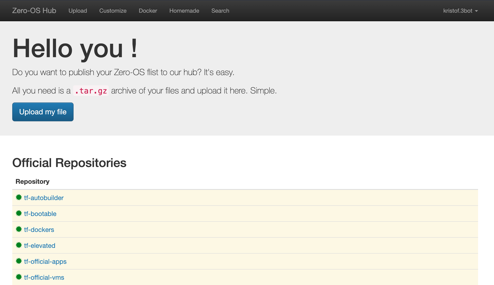

### What are web components?
Web Components is a bunch of different technologies bundeled together allowing the user to create reusable custom elements with their functionalities, which later on can be re-used and utilized in your web apps.
- Web components are based on four main specifications:

    1. Custom Elements

        Custom Elements specifications lay the foundation for designing and using new types of DOM elements. According to it authors can define HTML tags with their behaviours and styles.

    2. Shadow DOM

        The shadow DOM specification defines how to use encapsulated style and markup in web components. It represents the structure of an html document. Elements should have parent-child relationships.

    3. ES Modules

        The ES Modules specification defines the inclusion and reuse of JS documents in a standards based, modular, performant way.

    4. HTML Template

        The HTML template element specification defines how to declare fragments of markup that go unused at page load, but can be instantiated later on at runtime.Content between <template></template> tags won't render until it is activated and has no effect on other parts of the page - scripts won’t run, images won’t load, audio won’t play - until activated

- How to define a new HTML element?

    Start with a javascript class that extends HTMLElement.

    ```bash
    class CoverLetter extends HTMLElement {...}
    ```
    Then call customElements.define() with the desired tag name and the created javascript class
    ```bash
    window.customElements.define('cover-letter',CoverLetter);
    ```
    This will be the newly created tag:
    ```bash
    <cover-letter></cover-letter>

    ```

### [Svelte](https://svelte.dev/)

Svelte is a modern JavaScript framework used to build fast web applications. Users use Svelte to either build the entire app woth it or build reusable components that can work as standalone packages for any type of projects. 

In a svelete projects it usually consists of one or more components. Each components is a reusable self-contained block with its HTML, CSS and JaveScript/Typescript encapsulated.

Building a component should consist of three sections( Script section, HTML section, CSS section).

- Component Example

    1. Script Section

    ```bash
    <script>
    let name="Threefold Organisation"
    </script>
    ```
    2. HTML Section
    ```bash
    <h1>Hello {name}!</h1>
    ```
    3. CSS Section
    ```bash
    <style>
    h1{
        color:white;
        background-color:DodgerBlue;
    }
    </style>
    ```
    

Users sometimes need to access values by multiple unrelated components and that's where stores are used.
A svelte store is an object with a subscribe method that allows interested parties to be notified whenever the store value changes.

- Store Example

    A count store example which includes increment, decrement and reset methods. In this example we're going to make three re-usable components Incrementer , Decrementer and Resetter.

    In ```store.js``` file:

    ```bash
    import { writable } from 'svelte/store';

    export const count = writable(0);
    ``` 
    In ```Resetter.svelte``` file:

    ```bash
    <script>
        import { count } from './stores.js';

        function reset() {
            count.set(0);
        }
    </script>

    <button on:click={reset}>
        reset
    </button>
    ``` 
    In ```Incrementer.svelte``` file:

    ```bash
    <script>
        import { count } from './stores.js';

        function increment() {
            count.update(n => n + 1);
        }
    </script>

    <button on:click={increment}>
        +
    </button>
    ``` 

    In ```Decrementer.svelte``` file:

    ```bash
    <script>
        import { count } from './stores.js';

        function decrement() {
            count.update(n => n - 1);
        }
    </script>

    <button on:click={decrement}>
        -
    </button>
    ``` 

    In ```App.svelte``` file:

    ```bash
    <script>
        import { count } from './stores.js';

        function decrement() {
            count.update(n => n - 1);
        }
    </script>

    <script>
        import { count } from './stores.js';
        import Incrementer from './Incrementer.svelte';
        import Decrementer from './Decrementer.svelte';
        import Resetter from './Resetter.svelte';

        let countValue;

        const unsubscribe = count.subscribe(value => {
            countValue = value;
        });
    </script>

    <h1>The count is {countValue}</h1>

    <Incrementer/>
    <Decrementer/>
    <Resetter/>	-
    </button>
    ``` 

    Result:
    

One of the main reason svelte is used in developing our [weblets](https://play.grid.tf/#/) is components can be used as standalone packages that work anywhere.

## To build your own weblet, you need to:
- Choose your own solution
- Prepare the docker image
- Prepare the Flist
- Create a a weblet
- Set the solution provider

### 1. Choose your own solution
The solution we're choosing is going to be [pasty](https://github.com/lus/pasty) which is a fast and lightweight code pasting server. So let's check it.
1. Clone the repository:
```bash
git clone https://github.com/lus/pasty
```
2. Switch to specified directory
```bash 
cd pasty/
```
3. Build the application
```bash
go build -o pasty ./cmd/pasty/main.go
```


### 2. Prepare a docker image 
[Docker](https://www.docker.com/) packages software into standardized units called containers that have everything the software needs to run including libraries, system tools, code, and runtime.


In our case, Pasty already has a Dockerfile in its repository. We need to add some minor changes to the Dockerfile.

1. We need to add a directory to save the code pastes to
```bash
RUN mkdir ./file_name/
```
2. We need to create a new image in ubuntu based image that supports ssh server and run our pasty image in it.(inserts details here)

You can run the image using
```bash
docker run -d \
    -p 8080:8080 \
    --name pasty \
    -e PASTY_AUTODELETE="true" \
    -e PASTY_STORAGE_FILE_PATH="file_name"
    image-name
```


After that push the image to docker hub
```bash
docker push image-name
```

### 3. Prepare the flist


At this stage we need to convert our image into an flist. Navigate to [Zero-Os Hub](https://hub.grid.tf/) and login to your account. 


Steps to convert Docker image to an Flist:

1. Upload the Docker image to Docker Hub with the following command:

```bash
docker push <image_name>
```

2. Navigate to the docker converter [link](https://hub.grid.tf/docker-convert)
   

3. Copy the name of the uploaded Docker image to the Docker Image Name field.

4. Then press the convert button.

When the image is ready, some information will be displayed.


To Navigate to the created Flist Either search with the newly created file name in the search tab.


Or Navigate to your repository in the contributers section from the Zero-Os Hub and navigate to the newly created Flist.

Then press the preview button to display the Flist's url and some other data.


### 4. Create your own weblet
Create a svelte/typescript project.
```bash
yarn create vite
```
As Vite needs Node.js polyfills, we need to run the following command in the project's directory.

```bash
yarn add @esbuild-plugins/node-globals-polyfill @esbuild-plugins/node-modules-polyfill -D
```

Then we need to change the default configurations so we can use web components in out project.

```vite.config.ts``` file:
```bash
import { defineConfig } from "vite";
import { svelte } from "@sveltejs/vite-plugin-svelte";
import { NodeGlobalsPolyfillPlugin } from "@esbuild-plugins/node-globals-polyfill";
import { NodeModulesPolyfillPlugin } from "@esbuild-plugins/node-modules-polyfill";

// https://vitejs.dev/config/
export default defineConfig({
  plugins: [
    svelte({
      compilerOptions: {
        customElement: true,
      },
    }),
  ],

  optimizeDeps: {
    esbuildOptions: {
      define: {
        global: "globalThis",
      },
      // Enable esbuild polyfill plugins
      plugins: [
        NodeGlobalsPolyfillPlugin({
          buffer: true,
          process: true,
        }),
        NodeModulesPolyfillPlugin(),
      ],
    },
  },
});
```
```svelte.config.js``` file:
```bash
import sveltePreprocess from "svelte-preprocess";

export default {
  // Consult https://github.com/sveltejs/svelte-preprocess
  // for more information about preprocessors
  preprocess: sveltePreprocess(),
  compilerOptions: {
    customElement: true,
  },
};
```

We need to add our grid to the ```vite-env.d.ts``` file:
```bash
/// <reference types="svelte" />
/// <reference types="vite/client" />
import type * as grid3_client from "grid3_client/dist/node";

declare global {
  interface Window {
    grid3_client: GridClient;
  }
}
```
Next step is to install dependencies:
```bash
yarn
```

Now that the configuration is all set up, we need to prepare our classes and depoloyment files.

Create a new folder ```types``` and cd to it.

Add a ```Network.ts``` file:
```bash
import { v4 } from "uuid";

export class Network {
    constructor(
      public name: string = "NW" + v4().split("-")[0],
      public ipRange: string = "10.20.0.0/16"
    ) { }
  
    public get valid(): boolean {
      const { name, ipRange } = this;
      return name !== "" &&
        ipRange !== "" 
       
    }
  }
  ```
Add a ```rootFs.ts``` file:
```bash
import { Decimal } from "decimal.js";

const GB = 1024;

export default function rootFs(
  cpu_in_cores: number,
  mem_in_mb: number
): number {
 const cu = new Decimal(cpu_in_cores)
    .mul(mem_in_mb)
    .divToInt(8 * GB)
    .toNumber();

  return cu === 0 ? 500 / GB : 2;
}
```

Add a ```nodeId.ts``` file:
```bash
import type { ISelectOption } from "./index";

export default class NodeID {
  constructor(
    public type: "automatic" | "manual" = null,
    public filters = {
      publicIPs: null, 
      country: null,
      farmName: null, 
      cru: null, 
      mru: null, 
      sru: null, 

      update: (key: string, value: any) => {
        this.filters[key] = value;
      },
    },
    public nodes: ISelectOption[] = []
  ) {}
}
```
Add a ```pasty.ts``` file:
```bash
import { v4 } from "uuid";
import { Network } from "./Network";
import rootFs from "./rootFs";
import NodeID from "./nodeId";

export class Env {
    constructor(public id = v4(), public key = "", public value = "") {}
  
    public get valid(): boolean {
      const { key, value } = this;
      return key !== "" && value !== ""; 
    }
  }


export class Disk {

    constructor(
      public id = v4(),
      public name = "DISK" + id.split("-")[0],
      public size = 50,
      public mountpoint = `/mnt/${id.split("-")[0]}`
    ) {}
  
  
    public get valid(): boolean {
      const { name, size, mountpoint } = this;
      let point = mountpoint.trim();
  
      return (
        name !== "" &&
        point !== "" &&
        point !== "/" &&
        point.startsWith("/") 
      );
    }
  }
export default class Pasty {
    constructor(
      public id = v4(),
      public name = "VM" + id.split("-")[0],
      public flist = "https://hub.grid.tf/tf-official-apps/base:latest.flist",
      public pkg = "",
      public cpu = 4,
      public memory = 1024 * 8,
      public node_id= 13,
      public entrypoint = "/sbin/zinit init",
      public planetary = true,
      public nodeId: number = null,
      public solutionProviderID = 1,
  
      /* Network */
      public network = new Network(),
  
      public envs: Env[] = [],
      public disks: Disk[] = [],
      public publicIp = false,
      public publicIp6 = false,
  
      public selection = new NodeID(),
      public rootFs = 2,
      public rootFsEditable = false,
      ) {}
  
    public get valid(): boolean {
      const { name, flist, cpu, memory, entrypoint, nodeId, rootFs: rFs } = this;
      const { network, envs, disks } = this;
      return (
        name !== "" &&
        flist !== "" &&
        network.valid &&
        envs.reduce((res, env) => res && env.valid, true) &&
        disks.reduce((res, disk) => res && disk.valid, true) &&
        rFs >= rootFs(cpu, memory)
      );
    }
  }
  ```

  Create a new folder ```utils``` and cd to it.
   Add a ```getGrid.ts``` file:
   ```bash
   import { HTTPMessageBusClient } from "ts-rmb-http-client";

    export default async function getGrid(){
        const grid = new window.grid3_client.GridClient(
        window.grid3_client.NetworkEnv.dev,
        mnemonics,
        storeSecret,
        new HTTPMessageBusClient(0, "", "", ""),
        undefined,
        window.grid3_client.BackendStorageType.tfkvstore
      );
    
      try {
        await grid.connect();
        console.log(grid);
      } catch {}

      return grid;
    }
   ```
Add a ```CreateNetwork.ts``` file:
   ```bash
    import type { Network } from "../types/Network";

    export default function createNetwork(nw: Network, access: boolean = false) {
    const network = new window.grid3_client.NetworkModel();
    network.name = nw.name;
    network.ip_range = nw.ipRange;
    network.addAccess = access;
    return network;
    }

   ```

   Add a ```DeployPasty.ts``` file:
   ```bash
  import { Network } from "../types/Network";
import type { Disk, Env } from "../types/pasty";
import type Pasty from "../types/pasty";
import createNetwork from "./CreateNetwork";
import getGrid from "./getGrid";

export default async function deployPasty(
    data: Pasty,
    type: "pasty"
) {

    const grid = await getGrid();
 
    const { MachineModel, MachinesModel, QSFSDiskModel } = window.grid3_client;
    const { envs, disks, rootFs, ...base } = data;
    const { name, flist, cpu, memory, entrypoint, network: nw } = base;
    const { publicIp, planetary, node_id, publicIp6 } = base;


    const vm = new MachineModel();
    vm.name = name;
    vm.node_id = node_id;
    vm.disks = disks.map(createDisk);
    vm.public_ip = publicIp;
    vm.public_ip6 = publicIp6;
    vm.planetary = planetary;
    vm.cpu = cpu;
    vm.memory = memory;
    vm.rootfs_size = rootFs;
    vm.flist = flist;
    vm.entrypoint = entrypoint;
    vm.env = type == "pasty" ? createEnvs(envs) : { SSH_KEY: "" };

    const vms = new MachinesModel();
    vms.name = name;
    vms.network = createNetwork(new Network());
    vms.machines = [vm];
    const metadate = {
        type: "pasty",
        name: name,
        projectName: "pasty",
    };
    vms.metadata = JSON.stringify(metadate);
    const res = await grid.machines.deploy(vms);
    const l = await grid.machines.getObj(vms.name);

}

function createDisk({ name, size, mountpoint }: Disk) {
    const { DiskModel } = window.grid3_client;
    const disk = new DiskModel();
    disk.name = name;
    disk.size = size;
    disk.mountpoint = mountpoint;

    return disk;
}

function createEnvs(envs: Env[]): { [key: string]: string } {
    return envs.reduce((res, env) => {
        res[env.key] = env.value;
        return res;
    }, {});
}
   ```
   Add a components folder and cd to it.
   Add a simple input component ```Input.svelte``` file :
   ```bash
   <svelte:options tag="tf-input" />

<script lang="ts">
  export let type:string;
  export let label:string;
  export let name:string;
  export let checked:boolean=false;

</script>

<label for={name}>{label}</label>
<input {name} {type} {checked}  />
```
Add an elements folder and cd to it.
Add a simple form and data binding in  ```pasty.svelte``` file to deploy the machine:
```bash
<svelte:options tag="tf-pasty" />

<script lang="ts">
  import Input from "../components/Input.svelte";
  import Pasty from "../types/pasty";
    import deployPasty from "../utils/DeployPasty";

  let pasty = new Pasty();
  async function onSubmit(e) {
    const formData = new FormData(e.target);

    const data: any = {};
    for (let field of formData) {
      const [key, value] = field;
      if (value != "") {
        data[key] = value;
      }
    }
    await DeployPastyHandler(data);
  }

  function DeployPastyHandler(data: any) {
    if (data["name"] != "") {
      pasty.name = data["name"];
    }
    if (data["solutionprovider"] != "") {
      pasty.solutionProviderID = data["solutionprovider"];
    }
    if (data["cpu"] != "") {
      pasty.cpu = data["cpu"];
    }
    if (data["memory"] != "") {
      pasty.memory = data["memory"];
    }
    if (data["ip"]) {
      pasty.publicIp = data["ip"];
    }
    if (data["plantery"] == "on") {
      pasty.planetary = true;
    }
     deployPasty(pasty, "pasty");
  }
</script>

<form on:submit|preventDefault={onSubmit}>
  <div>
    <Input type="text" label="Name" name="name" />
  </div>
  <div>
    <Input type="number" label="Solution Provide Id" name="solutionprovider" />
  </div>
  <div>
    <Input type="number" label="CPU(vCores)" name="cpu" />
  </div>
  <div>
    <Input type="number" label="Memory(MB)" name="memory" />
  </div>

  <div>
    <Input type="checkbox" label="IP V4" name="ip" />
  </div>
  <div>
    <Input
      type="checkbox"
      label="Plantery Network "
      name="plantery"
      checked={true}
    />
  </div>

  <button>submit</button>
</form>
```


### 5.Set the solution provider


After following the step for creating your solution provider as mentioned [here](https://library.threefold.me/info/manual/#/manual__tfchain_solution_provider).

Setting The solution provider is as easy as adding it to the configuration of your machine.

```bash
vm.solutionProviderID = solutionProviderID;
```
