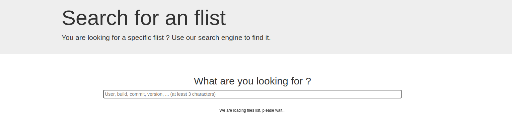

In this document a brief introduction about web components and svelte is given. In additon to that we'll be creating our own seperate weblet and test it with [grid3_client](https://github.com/threefoldtech/grid3_client_ts). 
### What are web components?
Web Components is a bunch of different technologies bundled together allowing the user to create reusable custom elements with their functionalities, which later on can be re-used and utilized in your web apps.
- Web components are based on four main specifications:

    1. Custom Elements

        Custom Elements specifications lay the foundation for designing and using new types of DOM elements. According to it authors can define HTML tags with their behaviors and styles.

    2. Shadow DOM

        The shadow DOM specification defines how to use encapsulated style and markup in web components. It represents the structure of an html document. Elements should have parent-child relationships.

    3. ES Modules

        The ES Modules specification defines the inclusion and reuse of JS documents in a standards based, modular, performant way.

    4. HTML Template

        The HTML template element specification defines how to declare fragments of markup that go unused at page load, but can be instantiated later on at runtime.Content between <template></template> tags won't render until it is activated and has no effect on other parts of the page - scripts won’t run, images won’t load, audio won’t play - until activated

- How to define a new HTML element?

    Start with a javascript class that extends HTMLElement.

    ```bash
    class CoverLetter extends HTMLElement {...}
    ```
    Then call customElements.define() with the desired tag name and the created javascript class
    ```bash
    window.customElements.define('cover-letter',CoverLetter);
    ```
    This will be the newly created tag:
    ```bash
    <cover-letter></cover-letter>

    ```

### [Svelte](https://svelte.dev/)

Svelte is a modern JavaScript framework used to build fast web applications. Users use Svelte to either build the entire app with it or build reusable components that can work as standalone packages for any type of projects. 

In a svelte projects it usually consists of one or more components. Each components is a reusable self-contained block with its HTML, CSS and JaveScript/Typescript encapsulated.

Building a component should consist of three sections( Script section, HTML section, CSS section).

- Component Example

    1. Script Section

    ```bash
    <script>
    let name="Threefold Organisation"
    </script>
    ```
    2. HTML Section
    ```bash
    <h1>Hello {name}!</h1>
    ```
    3. CSS Section
    ```bash
    <style>
    h1{
        color:white;
        background-color:DodgerBlue;
    }
    </style>
    ```
    

Users sometimes need to access values by multiple unrelated components and that's where stores are used.
A svelte store is an object with a subscribe method that allows interested parties to be notified whenever the store value changes.

- Store Example

    A count store example which includes increment, decrement and reset methods. In this example we're going to make three re-usable components Incrementer , Decrementer and Resetter.

    In ```stores.js``` file:

    ```bash
    import { writable } from 'svelte/store';

    export const count = writable(0);
    ``` 
    In ```Resetter.svelte``` file:

    ```bash
    <script>
        import { count } from './stores.js';

        function reset() {
            count.set(0);
        }
    </script>

    <button on:click={reset}>
        reset
    </button>
    ``` 
    In ```Incrementer.svelte``` file:

    ```bash
    <script>
        import { count } from './stores.js';

        function increment() {
            count.update(n => n + 1);
        }
    </script>

    <button on:click={increment}>
        +
    </button>
    ``` 

    In ```Decrementer.svelte``` file:

    ```bash
    <script>
        import { count } from './stores.js';

        function decrement() {
            count.update(n => n - 1);
        }
    </script>

    <button on:click={decrement}>
        -
    </button>
    ``` 

    In ```App.svelte``` file:

    ```bash
    <script>
        import { count } from './stores.js';
        import Incrementer from './Incrementer.svelte';
        import Decrementer from './Decrementer.svelte';
        import Resetter from './Resetter.svelte';

        let countValue;

        const unsubscribe = count.subscribe(value => {
            countValue = value;
        });
    </script>

    <h1>The count is {countValue}</h1>

    <Incrementer/>
    <Decrementer/>
    <Resetter/>	-
    </button>
    ``` 

    Result:
    

One of the main reasons svelte is used in developing our [weblets](https://play.grid.tf/#/) is that components can be used as standalone packages that work anywhere.

## To build your own weblet, you need to:
- Choose your own solution
- Prepare the docker image
- Prepare the Flist
- Create a weblet
- Set the solution provider

### 1. Choose your own solution
The solution we're choosing is going to be [pasty](https://github.com/lus/pasty) which is a fast and lightweight code pasting server. So let's check it.
1. Clone the repository:
```bash
git clone https://github.com/lus/pasty
```
2. Switch to specified directory
```bash 
cd pasty/
```
3. Build the application
```bash
go build -o pasty ./cmd/pasty/main.go
```


### 2. Prepare a docker image 
[Docker](https://www.docker.com/) packages software into standardized units called containers that have everything the software needs to run including libraries, system tools, code, and runtime.


In our case, Pasty already has a Dockerfile in its repository. We need to add some minor changes to the Dockerfile.

- We need to add a directory to save the code pastes to
```bash
RUN mkdir ./file_name/
```


 

You can run the image using
```bash
docker run -d \
    -p 8080:8080 \
    --name pasty \
    -e PASTY_AUTODELETE="true" \
    -e PASTY_STORAGE_FILE_PATH="file_name"
    image-name
```


After that push the image to docker hub
```bash
docker push <image-name>
```

After that we need to create a new image in ubuntu based image that runs with zinit, supports ssh server and run our pasty image in it.
- Add a zinit folder and cd to it:

In this folder we will have four zinit file, two to enable the ssh serve, one to enable docker daemon, and the last onw to pull and run our pasty image.

1- Add a ```sshd.yaml```:
```bash
exec: bash -c "/usr/sbin/sshd -D"
```
2- Add a ```sshkey.yaml```:
```bash
exec: |
  bash -c '
    if [ ! -z "$SSH_KEY" ]; then
      mkdir -p /var/run/sshd
      mkdir -p /root/.ssh
      touch /root/.ssh/authorized_keys
      
      chmod 700 /root/.ssh
      chmod 600 /root/.ssh/authorized_keys
      echo "$SSH_KEY" >> /root/.ssh/authorized_keys
    fi
  '
oneshot: true
```
3- Add a ```dockerd.yaml```:
```bash
exec: bash -c "dockerd -D"
test: docker ps
```
4- Add a ```pasty.yaml```:
```bash
exec: bash -c "docker run -d \
-p 8080:8080 --name pasty \
-e PASTY_AUTODELETE="true" \
-e PASTY_STORAGE_FILE_PATH="./savedpasty/" \ mayarosama/pasty:latest"
after: 
  - dockerd
```
- Add a ```Dockerfile```:

Install zinit and ssh servers and run the zinit process
```bash
FROM ubuntu:20.04

ENV DEBIAN_FRONTEND=noninteractive

RUN apt update && \
    apt -y install wget curl vim net-tools iputils-ping openssh-server docker.io 

RUN wget -O /sbin/zinit https://github.com/threefoldtech/zinit/releases/download/v0.2.5/zinit && \
    chmod +x /sbin/zinit

RUN mkdir -p /etc/zinit
COPY zinit /etc/zinit

ENTRYPOINT [ "/sbin/zinit", "init" ]
```
Now that our [docker image](https://github.com/maayarosama/Pasty_weblet/tree/master/Docker-pasty) is ready, build it and push it to dockerhub.


### 3. Prepare the flist


At this stage we need to convert our image into an flist. Navigate to [Zero-Os Hub](https://hub.grid.tf/) and login to your account. 


Steps to convert Docker image to an Flist:

1. Upload the Docker image to Docker Hub with the following command:

```bash
docker push <image_name>
```

2. Navigate to the docker converter [link](https://hub.grid.tf/docker-convert)
   

3. Copy the name of the uploaded Docker image to the Docker Image Name field.

4. Then press the convert button.

When the image is ready, some information will be displayed.


To Navigate to the created Flist Either search with the newly created file name in the search tab.



Or Navigate to your repository in the contributors section from the Zero-Os Hub and navigate to the newly created Flist.

Then press the preview button to display the Flist's url and some other data.


### 4. Create your own weblet
Create a svelte/typescript project.
```bash
yarn create vite
```
As Vite needs Node.js polyfills, we need to run the following command in the project's directory.

```bash
yarn add @esbuild-plugins/node-globals-polyfill @esbuild-plugins/node-modules-polyfill -D
```

Then we need to change the default configurations so we can use web components in out project.

```vite.config.ts``` file:
```bash
import { defineConfig } from "vite";
import { svelte } from "@sveltejs/vite-plugin-svelte";
import { NodeGlobalsPolyfillPlugin } from "@esbuild-plugins/node-globals-polyfill";
import { NodeModulesPolyfillPlugin } from "@esbuild-plugins/node-modules-polyfill";

// https://vitejs.dev/config/
export default defineConfig({
  plugins: [
    svelte({
      compilerOptions: {
        customElement: true,
      },
    }),
  ],

  optimizeDeps: {
    esbuildOptions: {
      define: {
        global: "globalThis",
      },
      // Enable esbuild polyfill plugins
      plugins: [
        NodeGlobalsPolyfillPlugin({
          buffer: true,
          process: true,
        }),
        NodeModulesPolyfillPlugin(),
      ],
    },
  },
});
```
```svelte.config.js``` file:
```bash
import sveltePreprocess from "svelte-preprocess";

export default {
  // Consult https://github.com/sveltejs/svelte-preprocess
  // for more information about preprocessors
  preprocess: sveltePreprocess(),
  compilerOptions: {
    customElement: true,
  },
};
```

We need to add our grid to the ```vite-env.d.ts``` file:
```bash
/// <reference types="svelte" />
/// <reference types="vite/client" />
import type * as grid3_client from "grid3_client/dist/node";

declare global {
  interface Window {
    grid3_client: GridClient;
  }
}
```
Next step is to install dependencies:
```bash
yarn
```

Now that the configuration is all set up, we need to prepare our classes and deployment files.

Create a new folder ```types``` and cd to it.

Add a ```Network.ts``` file:

In this file a network class is added to initiate any network instance with a name and ip range and validate them.
```bash
import { v4 } from "uuid";

export class Network {
    constructor(
      public name: string = "NW" + v4().split("-")[0],
      public ipRange: string = "10.20.0.0/16"
    ) { }
  
    public get valid(): boolean {
      const { name, ipRange } = this;
      return name !== "" &&
        ipRange !== "" 
       
    }
  }
  ```


  Add a ```nodeId.ts``` file:

In this file filters for selecting a node Id are added.
```bash
import type { ISelectOption } from "./index";

export default class NodeID {
  constructor(
    public type: "automatic" | "manual" = null,
    public filters = {
      // boolean
      publicIPs: null, // -

      // string
      country: null,
      farmName: null, // *

      // number
      cru: null, // *
      mru: null, // *
      sru: null, // *

      /* updater */
      update: (key: string, value: any) => {
        this.filters[key] = value;
      },
    },
    public nodes: ISelectOption[] = []
  ) {}
}
  ```
Add a ```rootFs.ts``` file:

In this file a rootFs class is added to calculate the cu value from cpu and memory values.
```bash
import { Decimal } from "decimal.js";

const GB = 1024;

export default function rootFs(
  cpu_in_cores: number,
  mem_in_mb: number
): number {
 const cu = new Decimal(cpu_in_cores)
    .mul(mem_in_mb)
    .divToInt(8 * GB)
    .toNumber();

  return cu === 0 ? 500 / GB : 2;
}
```

Add a ```pasty.ts``` file:

In this file a pasty class is added to initiate all values needed to deploy.
```bash
import { v4 } from "uuid";
import type { IFormField } from ".";
import { Network } from "./Network";
import NodeID from "./nodeId";
import rootFs from "./rootFs";

export class Env {
    constructor(public id = v4(), public key = "", public value = "") {}
  
    public get valid(): boolean {
      const { key, value } = this;
      return key !== "" && value !== ""; 
    }
  }


  export class Disk {
    // prettier-ignore
    public diskFields: IFormField[] = [
      { label: "Name", symbol: "name", placeholder: "Disk Name", type: "text", invalid:false },
      { label: "Size (GB)", symbol: "size", placeholder: "Disk size in GB", type: "number", invalid: false },
      { label: "Mount Point", symbol: "mountpoint", placeholder: "Disk Mount Point", type: "text",  invalid: false},
    ]
   
    
    constructor(
      public id = v4(),
      public name = "DISK" + id.split("-")[0],
      public size = 50,
      public mountpoint = `/mnt/${id.split("-")[0]}`
    ) {}
  
    get _diskFieldsValid(): boolean {
      return this.diskFields.reduce((res, field) => {
        if (field.invalid === undefined) return res;
        return res && !field.invalid;
      }, true);
    }
  
    public get valid(): boolean {
      const { name, size, mountpoint } = this;
      let point = mountpoint.trim();
  
      return (
        name !== "" &&
        point !== "" &&
        point !== "/" &&
        point.startsWith("/") &&
        this._diskFieldsValid
      );
    }
  }
export default class Pasty {
    constructor(
      public id = v4(),
      public name = "VM" + id.split("-")[0],
      public flist = "https://hub.grid.tf/tf-official-apps/base:latest.flist",
      public pkg = "",
      public cpu = 4,
      public memory = 1024 * 8,
      public node_id,
      public entrypoint = "/sbin/zinit init",
      public planetary = true,
      public nodeId: number = null,
      public solutionProviderID = 1,
  
      /* Network */
      public network = new Network(),
  
      public envs: Env[] = [],
      public disks: Disk[] = [],
      public publicIp = false,
      public publicIp6 = false,
  
      public selection = new NodeID(),
      public rootFs = 2,
  
    ) {}
  
    public get valid(): boolean {
      const { name, flist, cpu, memory, entrypoint, nodeId, rootFs: rFs } = this;
      const { network, envs, disks } = this;
      return (
        name !== "" &&
        flist !== "" &&
        network.valid &&
        envs.reduce((res, env) => res && env.valid, true) &&
        disks.reduce((res, disk) => res && disk.valid, true) &&
        rFs >= rootFs(cpu, memory)
      );
    }
  }
  ```

  Create a new folder ```utils``` and cd to it.

  Add a ```getGrid.ts``` file:

   In this file a getGrid method is added to connect to the grid with the user's information{mnemonics,storeSecret}.
   ```bash
   import { HTTPMessageBusClient } from "ts-rmb-http-client";

    export default async function getGrid(){
        const grid = new window.grid3_client.GridClient(
        window.grid3_client.NetworkEnv.dev,
        mnemonics,
        storeSecret,
        new HTTPMessageBusClient(0, "", "", ""),
        undefined,
        window.grid3_client.BackendStorageType.tfkvstore
      );
    
      try {
        await grid.connect();
        console.log(grid);
      } catch {}

      return grid;
    }
   ```
  Add a ```CreateNetwork.ts``` file:
   ```bash
    import type { Network } from "../types/Network";

    export default function createNetwork(nw: Network, access: boolean = false) {
    const network = new window.grid3_client.NetworkModel();
    network.name = nw.name;
    network.ip_range = nw.ipRange;
    network.addAccess = access;
    return network;
    }

   ```

  Add a ```fetchCountries.ts``` file:
   ```bash
    export async function fetchCountries() : Promise<any> {
    const grid = new window.grid3_client.GridClient(
      "" as any,
      "",
      "",
      null
    );
  
    const { rmbProxy } = grid.getDefaultUrls( window.grid3_client.NetworkEnv.qa );
    let data : any;
  
    return fetch(`${rmbProxy}/stats?status=up`, {
      method: "GET",
    })
      .then(data = response => response.json())
      .then(response => response["nodesDistribution"])
      .catch((err) => {console.log(err) ; return err});
  }
   ```

     Add a ```fetchFarms.ts``` file:
   ```bash
   import type { FilterOptions } from "grid3_client";
import gqlApi from "./gplApi";
import { getBlockedFarmsIDs } from "./findNodes";
import paginatedFetcher from "./paginatedFetcher";

const queryCount = `
query GetLimits {
    farms: farmsConnection(orderBy: farmID_ASC) { farms_limit: totalCount }
}
`;

const queryCountIPFilter = `
query GetLimits {
  farms: farmsConnection(where: {publicIPs_some: {}}, orderBy: farmID_ASC) { farms_limit: totalCount }
}
`;

interface IQueryCount {
  farms: { farms_limit: number };
}

const queryData = `
query GetData($farms_limit: Int!) {
    farms(limit: $farms_limit) { name farmID }
}
`;

const queryDataIPFilter = `
query GetData($farms_limit: Int!) {
  farms(limit: $farms_limit, where: {publicIPs_some: {}}) {
    name
    farmID
  }
}
`;

interface IQueryData {
  farms: Array<{ name: string }>;
}

export default function fetchFarms(
  filters: FilterOptions,
  exclusiveFor: string
) {
  var query = queryCount;
  var queryDataSelect = queryData;
  if (filters.publicIPs) {
    query = queryCountIPFilter;
    queryDataSelect = queryDataIPFilter;
  }

  return gqlApi<IQueryCount>( query)
    .then(({ farms: { farms_limit } }) => {
      return { farms_limit };
    })
    .then(async (vars) => {
      let { farms } = await gqlApi<IQueryData>( queryDataSelect, vars);

      farms = await getOnlineFarms(
        farms,
        exclusiveFor,
        filters.publicIPs
      );

      return { farms };
    });
}

export async function getOnlineFarms( farms, exclusiveFor, publicIp) {
  const grid = new window.grid3_client.GridClient(
    "" as any,
    "",
    "",
    null
  );

  const { graphql, rmbProxy } = grid.getDefaultUrls(window.grid3_client.NetworkEnv.qa);

  let blockedFarms = [];
  let onlineFarmsSet = new Set();
  let onlineFarmsArr = [];


  const upNodes = await paginatedFetcher(
    `${rmbProxy}/nodes?&status=up`,
    0,
    50
  );

  for (let node of upNodes) {
    if (!blockedFarms.includes(node.farmId)) {
      onlineFarmsSet.add(node.farmId);
    }
  }

  onlineFarmsArr = Array.from(onlineFarmsSet);

  const onlineFarms = farms.filter((farm) =>
    onlineFarmsArr.includes(farm.farmID)
  );

  return onlineFarms;
}
   ```


  Add a ```findNodes.ts``` file:
   ```bash
  import type { ISelectOption } from "../types";
import type { FilterOptions } from "grid3_client";

export default function findNodes(
  filters: FilterOptions,
  exclusiveFor = ""
): Promise<ISelectOption[]> {
  return new Promise(async (res) => {
    const grid = new window.grid3_client.GridClient(
      "" as any,
      "",
      "",
      null
    );

    const { graphql, rmbProxy } = grid.getDefaultUrls(window.grid3_client.NetworkEnv.qa);
    const nodes = new window.grid3_client.Nodes(graphql, rmbProxy, grid.rmbClient);

    try {
      let avilableNodes = await nodes.filterNodes(filters);

      if (!filters.publicIPs && exclusiveFor != "") {
        const blockedNodes = await getBlockedNodesIDs(
          exclusiveFor,
          rmbProxy,
          graphql
        );

        // remove the blocked nodes from the nodes the first page
        avilableNodes = exclude(blockedNodes, avilableNodes);

        let pageNumber = 1;
        // check if there are more pages
        while (avilableNodes.length === 0) {
          try {
            pageNumber += 1;
            avilableNodes = await nodes.filterNodes({
              ...filters,
              page: pageNumber,
            });
            avilableNodes = exclude(blockedNodes, avilableNodes);
          } catch (err) {
            console.log("End of the pages.");
            break;
          }
        }
      }

      const resNodes = avilableNodes.map((node) => {
        return {
          label: `NodeID(${node.nodeId})`,
          value: node.nodeId,
        } as ISelectOption;
      });
      res(resNodes);
    } catch (err) {
      console.log("Error findNodes", err);
      res([]);
    }
  });
}

async function getBlockedNodesIDs(
  exclusiveFor: string,
  rmbProxy: string,
  graphql: string
): Promise<number[]> {
  // This step for preventing select a node that already has a deployment of the same type.
  // For now, it is only used with presearch.
  const gqlClient = new window.grid3_client.Graphql(graphql);

  let blockedFarmsIDs = await getBlockedFarmsIDs(
    exclusiveFor,
    rmbProxy,
    graphql
  );

  // get all the nodeIds of all the farms
  let farmsIDs = `[${blockedFarmsIDs.join(", ")}]`;
  const res = await gqlClient.query(
    `query MyQuery {
      nodes(where: {farmID_in: ${farmsIDs}}) {
        nodeID
      }
    }`
  );
  let farmNodesIDs = [...res.data["nodes"]];

  return farmNodesIDs;
}

export async function getBlockedFarmsIDs(
  exclusiveFor: string,
  rmbProxy: string,
  graphql: string
): Promise<number[]> {
  const gqlClient = new window.grid3_client.Graphql(graphql);

  // get the total number of deployment of the same type
  const res1 = (await gqlClient.query(`query MyQuery {
          nodeContractsConnection(orderBy: id_ASC, where: {deploymentData_contains: "${exclusiveFor}", state_eq: Created}) {
            totalCount
          }
        }`)) as any;
  const totalNumber = res1.data.nodeContractsConnection.totalCount;

  // get the nodeIds of the deployments
  const res2 = (await gqlClient.query(`query MyQuery {
            nodeContracts(where: {deploymentData_contains: "${exclusiveFor}", state_eq: Created}, limit: ${totalNumber}) {
              nodeID
            }
          }`)) as any;
  const nodeIds = res2.data.nodeContracts.map((n) => n.nodeID);

  // get the farmIds of all the used nodes. "in Set to remove duplicates"
  let farmIds = new Set<number>();
  for (let nodeId of nodeIds) {
    const res = await fetch(`${rmbProxy}/nodes/${nodeId}`);
    farmIds.add((await res.json())["farmId"]);
  }
  let farmIdsarr = Array.from(farmIds);

  return farmIdsarr;
}

function exclude(blocked, all) {
  // make a list of ids for the blocked nodes
  const blockedNodesIds = blocked.map((n) => n.nodeID);

  return all.filter((item) => !blockedNodesIds.includes(item.nodeId));
}
   ```


Add a ```gplApi.ts``` file:
   ```bash
   export default function gqlApi<T>(
  query: string,
  variables: Object = {}
): Promise<T> {
  const grid = new window.grid3_client.GridClient(
    "" as any,
    "",
    "",
    null
  );

  const { graphql } = grid.getDefaultUrls(window.grid3_client.NetworkEnv.qa);

  return fetch(graphql, {
    method: "POST",
    headers: {
      "Content-Type": "application/json",
    },
    body: JSON.stringify({ query, variables }),
  })
    .then((res) => res.json())
    .then<T>(({ data }) => data);
}
   ```
 Add a ```paginatedFetcher.ts``` file:
   ```bash
   export default async function paginatedFetcher(
    url: string,
    page: number,
    pageSize: number,
    previousResponse = []
  ): Promise<any> {
    const response = await fetch(`${url}&page=${page}&size=${pageSize}`);
    const data = await response.json();
    if (data.length === 0) {
      return previousResponse;
    }
    return paginatedFetcher(
      url,
      page + 1,
      pageSize,
      previousResponse.concat(data)
    );
  }
  
   ```

  Add a ```DeployPasty.ts``` file:
   ```bash
 import { Network } from "../types/Network";
import type { Disk, Env } from "../types/pasty";
import type Pasty from "../types/pasty";
import createNetwork from "./CreateNetwork";
import getGrid from "./getGrid";

export default async function deployPasty(
    data: Pasty,
    type: "vm"
) {

    const grid = await getGrid();
 
    const { MachineModel, MachinesModel, QSFSDiskModel } = window.grid3_client;
    const { envs, disks, rootFs, ...base } = data;
    const { name, flist, cpu, memory, entrypoint, network: nw } = base;
    const { publicIp, planetary, node_id, publicIp6 } = base;


    const vm = new MachineModel();
    vm.name = name;
    vm.node_id = base.nodeId;
    vm.disks = disks.map(createDisk);
    vm.public_ip = publicIp;
    vm.public_ip6 = publicIp6;
    vm.planetary = planetary;
    vm.cpu = cpu;
    vm.memory = memory;
    vm.rootfs_size = rootFs;
    vm.flist = "https://hub.grid.tf/mayarosama.3bot/mayarosama-zinitpasty-latest.flist";
    vm.entrypoint = entrypoint;
    vm.env = type == "vm" ? createEnvs(envs) : { SSH_KEY: "" };
    const vms = new MachinesModel();
    vms.name = name;
    vms.network = createNetwork(new Network());
    vms.machines = [vm];
    const metadate = {
        type: "vm",
        name: name,
        projectName: "vm",
    };
    vms.metadata = JSON.stringify(metadate);
    const res = await grid.machines.deploy(vms);

    const pasty =await grid.machines.getObj(vms.name);
    return pasty;
}

function createDisk({ name, size, mountpoint }: Disk) {
    const { DiskModel } = window.grid3_client;
    const disk = new DiskModel();
    disk.name = name;
    disk.size = size;
    disk.mountpoint = mountpoint;

    return disk;
}

function createEnvs(envs: Env[]): { [key: string]: string } {
    return envs.reduce((res, env) => {
        res[env.key] = env.value;
        return res;
    }, {});
}
   ```
   Add a components folder and cd to it.

   Add an Alert component in ```Alert.svelte``` file :
   ```bash
  <svelte:options tag="tf-alert" />

<script lang="ts">
  export let type: "info" | "success" | "danger" | "warning" | "gray";
  export let message: string;
  export let deployed:Boolean = false;

  function selectColor(t: typeof type): string {
    switch (t) {
      case "info":
        return "#1982b1";
      case "danger":
        return "#FF5151";
      case "success":
        return "#1982b1";
      default:
        return "";
    }
  }

  setTimeout(() => { deployed = false; }, 120000);

</script>

{#if type == "gray"}
  <div
    class="notification"
    style={`background-color: transparent; color: #333`}
  >
    {@html message}
  </div>
{:else if type == "warning"}
  <div class="notification" style={`background-color: #fffaeb; color: #946c00`}>
    {@html message}
  </div>
{:else}
  <div
    class={"notification"}
    style={`background-color: ${selectColor(type)}; color: white`}
  >
    {@html message}
  </div>
{/if}

{#if deployed}
  <div
    class={"notification"}
    style={`background-color: ${selectColor(type)}; color: white`}
  >
    Your solution is now starting. Please be patient
  </div>
{/if}
<style lang="scss" scoped>
  @import url("https://cdn.jsdelivr.net/npm/bulma@0.9.3/css/bulma.min.css");
</style>
```

 Add an AddBtn component in ```AddBtn.svelte``` file :
   ```bash
  <svelte:options tag="tf-add-btn" />

<div class="is-flex is-justify-content-flex-end is-align-items-center">
  <button
    type="button"
    class="button"
    style={`background-color: #1982b1; color: white`}
    on:click
  >
    <span>+ Add</span>
  </button>
</div>
```

 Add a DeleteBtn component in ```DeleteBtn.svelte``` file :
   ```bash
<svelte:options tag="tf-delete-btn" />

<script lang="ts">
  export let name: string;
</script>

<div class="is-flex is-justify-content-space-between is-align-items-center">
  <p on:click class="is-size-5 has-text-weight-bold">{name}</p>
  <span  class= "button"style={`background-color: #1982b1; color: white`} on:click>
    - Delete
  </span>
</div>

<style lang="scss" scoped>
  @import url("https://cdn.jsdelivr.net/npm/bulma@0.9.3/css/bulma.min.css");
  @import url("https://cdnjs.cloudflare.com/ajax/libs/font-awesome/6.0.0-beta3/css/all.min.css");
  .icon {
    color: #454545 !important;
    cursor: pointer;
  }
</style>
```

Add a DeployBtn component in ```DeployBtn.svelte``` file :
   ```bash
<svelte:options tag="tf-deploy-btn" />

<script lang="ts">

  export let loading: boolean;
  export let success: boolean;
  export let failed: boolean;
  export let disabled: boolean;
  export let label: string = "Deploy";
</script>

<div class="is-flex is-justify-content-space-between is-align-items-center">
  <div style="width: 100%; padding-right: 15px;">
    {#if loading}
      <div class="notification is-warning is-light">
        <strong>Warning!</strong> Make sure to not leave the page if there is an
        in-progress deployment or deletion.
      </div>
   
    {/if}
  </div>
  <button
    class={"button " + (loading ? "is-loading" : "")}
    style={`background-color: #1982b1; color: white`}
    type="submit"
    on:click
    disabled={disabled}
  >
    {#if success || failed}
      Back
    {:else}
      {label}
    {/if}
  </button>
</div>
```


Add an Input component in ```Input.svelte``` file :
   ```bash
<svelte:options tag="tf-inputt" />

<script lang="ts">
  import { createEventDispatcher, onMount } from "svelte";
  import type { IFormField } from "../types";
  import { v4 } from "uuid";

  const dispatch = createEventDispatcher<{ input: Event }>();
  export let field: IFormField;
  export let data: any;
  export let selected: number = 0;
  export let invalid = false;

  $: numericData = data?.toString();

  const id = v4();


  function _onSelectChange(e: Event) {
    dispatch("input", e);
    const select = e.target as HTMLSelectElement;
    selected = select.selectedIndex;
  }

  function _onInput(e: Event) {
    const target = e.target as HTMLInputElement;
    const isNum = target.getAttribute("data-type") === "number";

    if (isNum) {
      if (!invalid) {
        (e as any).target.value = +(e as any).target.value;
      }

      data = !invalid ? +numericData : numericData;
    }

    dispatch("input", e);
  }

  const selectStyle = `
<style>
  @import url("https://cdnjs.cloudflare.com/ajax/libs/font-awesome/6.0.0-beta3/css/all.min.css");

  .switch {
    position: relative;
    display: inline-block;
    width: 60px;
    height: 34px;
  }

  .switch .switch__input {
    opacity: 0;
    width: 0;
    height: 0;
  }

  .slider {
    position: absolute;
    cursor: pointer;
    top: 0;
    left: 0;
    right: 0;
    bottom: 0;
    background-color: #ccc;
    -webkit-transition: 0.4s;
    transition: 0.4s;
    border-radius: 34px;
  }

  .slider:before {
    position: absolute;
    content: "";
    height: 26px;
    width: 26px;
    left: 4px;
    bottom: 4px;
    background-color: white;
    -webkit-transition: 0.4s;
    transition: 0.4s;
    border-radius: 50%;
  }

  .switch__input:checked + .slider {
    background-color: #1982b1;
  }

  .switch__input:checked + .slider {
    box-shadow: 0 0 1px #1982b1; 
  }

  .switch__input:checked + .slider:before {
    -webkit-transform: translateX(26px);
    -ms-transform: translateX(26px);
    transform: translateX(26px);
  }

  
  [disabled] { cursor: inherit !important; }
</style>
`;
</script>

<div>
  {@html selectStyle}
</div>

{#if field}
  <div class="tooltip mb-2">

        {#if field.type === "text"}
          <div class="field" {id}>
            <p class="label">{field.label}</p>
            <input
              type="text"
              class={"input"}
              placeholder={field.placeholder}
              bind:value={data}
              on:input={_onInput}
              disabled={field.disabled}
            />
          </div>
        {:else if field.type === "number"}
          <div class="field" {id}>
            <p class="label">{field.label}</p>
            <input
              type="text"
              data-type="number"
              class={"input"}
              placeholder={field.placeholder}
              bind:value={numericData}
              on:input={_onInput}
              disabled={field.disabled}
              maxlength="15"
            />
          </div>
        {/if}
    
    {#if field.type === "checkbox"}
      <div style="display: flex; align-items: center;" class="mb-2">
        <label class="switch">
          <input
            class="switch__input"
            type="checkbox"
            bind:checked={data}
            {id}
            on:input
            disabled={field.disabled}
          />
          <span class="slider" />
        </label>
        <label for={id} class="label ml-2" style="cursor: pointer;">
          {field.label}
        </label>
      </div>
    {:else if field.type === "select"}
      {#if field.label}
        <p class="label">{field.label}</p>
      {/if}
      <div class={"select mb-2"} style="width: 100%;" {id}>
        <select
          disabled={field.disabled}
          style="width: 100%;"
          bind:value={data}
          on:change={_onSelectChange}
        >
          {#each field.options as option (option.value)}
            <option
              value={option.value}
              selected={option.selected}
              disabled={option.disabled}
            >
              {option.label}
            </option>
          {/each}
        </select>
      </div>
    {/if}
  </div>
{/if}
```

Add a Tabs component in ```Tabs.svelte``` file :
   ```bash
<svelte:options tag="tf-tabs" />

<script lang="ts">
  import type { ITab } from "../types";
  import { createEventDispatcher, onMount } from "svelte";

  const dispatch =
    createEventDispatcher<{ removed: number; select: string; init: void }>();

  export let tabs: ITab[];
  export let active: string;
  export let disabled: boolean = false;
  export let selectedTab: string = null;
  export let selectedID: number = null;


  function onSelectTab(tab: string) {
    if (active !== tab) {
      active = tab;
      dispatch("select", tab);
    }
  }

  onMount(() => {
    dispatch("init");
  });
</script>

<div class={"tabs is-centered"}>
  <ul style={disabled ? "pointer-events: none; cursor: default;" : ""}>
    {#if tabs}
      {#each tabs as tab, index (tab.label)}
        <li class={active === tab.value ? "is-active" : ""}>
          <a
            href="#!"
            on:click|preventDefault={onSelectTab.bind(undefined, tab.value)}
          >
            <span>{tab.label}</span>
           
          </a>
        </li>
      {/each}
    {/if}
  </ul>
</div>

<style lang="scss" scoped>
  @import url("https://cdn.jsdelivr.net/npm/bulma@0.9.3/css/bulma.min.css");
</style>
```

Add a SelectNodeId component in ```SelectNodeId.svelte``` file :
   ```bash
<svelte:options tag="tf-select-node-id" />

<script lang="ts">
  import { createEventDispatcher } from "svelte";
  import type { IFormField, ISelectOption } from "../types";
  import findNodes from "../utils/findNodes";
  import fetchFarms from "../utils/fetchFarms";
  import { fetchCountries } from "../utils/fetchCountries";

  // components
  import Input from "./Input.svelte";
  import gqlApi from "../utils/gplApi";

  const { GridClient } = window.grid3_client ?? {};

  const dispatch = createEventDispatcher<{
    fetch: ISelectOption[];
    multiple: number[];
  }>();
  export let cpu: number;
  export let memory: number;
  export let disk: number= undefined;
  export let ssd: number;
  export let publicIp: boolean;
  export let data: number = undefined;
  export let status: "valid" | "invalid" | "dedicated" | "not found" =
    undefined;
  export let nodes: ISelectOption[] = [];

  export let exclusiveFor: string = "";

  let loadingNodes: boolean = false;

  export let multiple: number = undefined;
  export let count: number = undefined;
  let disabledMultiSelect: boolean = false;


  // prettier-ignore
  const filtersFields: IFormField[] = [
    { label: "Farm Name", symbol: "farmName", type: "select", placeholder: "Enter Farm Name", options: [
      { label: "Please select a farm", value: null, selected: true }
    ] },
    { label: "Country", symbol: "country", type: "select", placeholder: "Enter Country Name", options: [
      { label: "Please select a country", value: null, selected: true }
    ] },
  ];

  // prettier-ignore
  const nodeIdSelectField /* : IFormField */ = {
    options: [
      { label: "Please select a node id.", value: null, selected: true, disabled: true },
    ] as ISelectOption[]
  };

  // prettier-ignore
  let nodeSelectionField: IFormField = {
    label: "Node Selection",
    type: "select",
    symbol: "value",
    options: [
      { label: "Choose a way to select node", value: null, selected: true, disabled: true },
      { label: "Capacity Filter", value: "automatic" },
      { label: "Manual", value: "manual" }
    ]
  };
  export let nodeSelection: string = undefined;
  

  export let filters: any;


  $: {
    if (filters) {
      if (cpu) filters.update("cru", cpu);
      if (memory) filters.update("mru", Math.round(memory / 1024));
      if (disk) filters.update("hru", disk);
      if (ssd) filters.update("sru", ssd);
      filters.update("publicIPs", publicIp);
    }
  }

  function onLoadNodesHandler() {
    loadingNodes = true;
    status = null;
    const label = "Please select a node id.";
    nodeIdSelectField.options[0].label = "Loading...";

    console.log("filters",filters)
    const _filters = {
      publicIPs: filters.publicIPs,
      country: filters.country,
      farmName: filters.farmName,
      cru: filters.cru,
      mru: filters.mru,
      sru: filters.sru,
      hru: filters.hru,
    };

    findNodes(_filters, exclusiveFor)
      .then((_nodes) => {
        dispatch("fetch", _nodes);
        if (_nodes.length <= 0) {
          data = null;
          status = null;
          nodes= _nodes
          nodeIdSelectField.options[0].label = "No nodes available";
        } else if (!_nodes.some((node) => node.value === data)) {
          nodeIdSelectField.options[0].label = label;
          nodes = _nodes;
          data = +_nodes[0].value;
          status = "valid";
        } else {
          nodeIdSelectField.options[0].label = label;
          status = "valid";
        }
      })
      .catch((err) => {
        console.log("Error", err);
        data = null;
        status = null;
        nodeIdSelectField.options[0].label = "No nodes available";
      })
      .finally(() => {
        loadingNodes = false;
      });
  }

  $: {
    const [option] = nodeIdSelectField.options;
    nodeIdSelectField.options = [option, ...nodes];
  }

  function _setLabel(index: number, oldLabel: string,  label: string = "Loading...") {
    filtersFields[index].options[0].label = label;
    return oldLabel;
  }

  function _setOptions(
    index: number,
    items: Array<{ name: string; code?: string }>
  ) {
    const [option] = filtersFields[index].options;
    filtersFields[index].options = items.reduce(
      (res, { name, code }) => {
        const op = { label: name, value: name } as ISelectOption;
        res.push(op);
        return res;
      },
      [option]
    );
  }

  function _setCountriesOptions(
    index: number,
    items: Map< string, Number >
  ) {
    const [option] = filtersFields[index].options;
    filtersFields[index].options = Object.entries(items).map( function ([name, code]) {
        const op = { label: name, value: name } as ISelectOption;
        return op;
      },
    );
    filtersFields[index].options.unshift(option);
  }

  let _network: string;
  $: {
    if (
      (nodeSelection === "automatic" || multiple) &&
      window.grid3_client.NetworkEnv.dev !== _network
    ) {
      /* Cache last used network */
      _network = window.grid3_client.NetworkEnv.dev;

      onLoadFarmsHandler();
    }
  }

  function onLoadFarmsHandler(){
    /* Loading farms & countries */
    const old_farm_label = "Please select a farm";
    const old_countries_label = "Please select a country";

    const farmsLabel = _setLabel(0, old_farm_label);
    const countriesLabel = _setLabel(1, old_countries_label);

    fetchFarms( filters, exclusiveFor)
      .then(({ farms }) => {
        farms.sort((f0, f1) => f0.name.localeCompare(f1.name));
        _setOptions(0, farms);
      })
      .catch((err) => {
        console.log("Error", err);
      })
      .finally(() => {
        _setLabel(0, old_farm_label, farmsLabel);
      });

    fetchCountries()
      .then(( countries ) => {
        _setCountriesOptions(1, countries);
      })
      .catch((err) => {
        console.log("Error", err);
      })
      .finally(() => {
        _setLabel(1, old_countries_label, countriesLabel);
      });
  }

  function _update(key: string) {
    return (e: { detail: Event }) => {
      const inp = e.detail.target as HTMLInputElement;
      filters.update(key, inp.value);


      // console.log("rxfcgdd",filters.find(key));
    };
  }

  function _nodeValidator(value: number) {
    value = +value;
    if (typeof value !== "number") return "Please select a node.";
    if (value < 1) return "Please select a valid node";
  }

  const nodeIdField: IFormField = {
    label: "Node ID",
    symbol: "nodeId",
    type: "number",
    placeholder: "Your Node ID",
  };

  interface IResources { cru: number; sru: number; hru: number; mru: number; ipv4u: number; } // prettier-ignore
  interface ICapacity { total_resources: IResources; used_resources: IResources; } // prettier-ignore

  let _ctrl: AbortController;
  let _nodeId: number;
  let validating: boolean = false;
  $: {
    if (nodeSelection === "manual")
      if (_nodeId !== data) {
        if (!data || !!_nodeValidator(data)) {
          if (_ctrl) {
            _ctrl.abort();
            _ctrl = null;
          }
          validating = false;
          status = null;
        } else {
          _nodeId = data;
          if (_ctrl) _ctrl.abort();
          _ctrl = new AbortController();

          
          const grid = new GridClient("" as any, "", "", null);
          const { rmbProxy } = grid.getDefaultUrls(window.grid3_client.NetworkEnv.dev);

          validating = true;
          status = null;
          fetch(`${rmbProxy}/nodes/${data}`, {
            method: "GET",
            signal: _ctrl.signal,
          })
            .then<{ capacity: ICapacity }>((res) => res.json())
            .then((node: any) => {
              if (node.error){
                status = "not found";
                return;
              }

 
              if (node.status !== "up") {
                status = "invalid";
                return;
              }

              const { total_resources: total, used_resources: used } =
                node.capacity;
              // prettier-ignore
              let hasEnoughResources = ((total.sru - used.sru) / 1024 ** 3) >= filters.sru &&
                        ((total.mru - used.mru) / 1024 ** 3) >= filters.mru;
              if (!hasEnoughResources) {
                status = "invalid";
                return;
              }

              if (filters.publicIPs) {
                return gqlApi<{ nodes: { id: number }[] }>(
                  "query getFarmId($id: Int!) { nodes(where: { nodeID_eq: $id }) { id: farmID }}",
                  { id: data }
                )
                  .then(({ nodes: [{ id }] }) => {
                    return gqlApi<{publicIps: []}>( 'query getIps($id: Int!) { publicIps(where: { contractId_eq: 0, farm: {farmID_eq: $id}}) {id}}', { id }); // prettier-ignore
                  })
                  .then(({ publicIps: ips }) => {
                    status = ips.length > 0 ? "valid" : "invalid";
                  });
              } else {
                status = "valid";
              }
            })
            .catch((err: Error) => {
              console.log("Error", err);
              if (err.message.includes("aborted a request")) return;
              status = "invalid";
            })
            .finally(() => {
              validating = false;
            });
        }
      }
  }

  /* Update when data change */
  let _cpu = cpu;
  let _memory = memory;
  let _ssd = ssd;
  let _publicIp = publicIp;
  let _disk= disk;

  const _reset = () => {
    requestAnimationFrame(() => {
      _nodeId = null;
      if (nodeSelection === "automatic" || multiple) {
        onLoadNodesHandler();
        onLoadFarmsHandler();
      }
    });
  };

  $: {
    let _update = true;

    if (_cpu !== cpu) _cpu = cpu;
    else if (_memory !== memory) _memory = memory;
    else if (_ssd !== ssd) _ssd = ssd;
    else if (_publicIp !== publicIp) _publicIp = publicIp;
    else if (_disk !== disk|| multiple || count) _disk = disk;
    else _update = false;

    if (_update) _reset();
  }
</script>

{#if !multiple}
  <Input
    bind:data={nodeSelection}
    field={nodeSelectionField}
    on:input={() => {
      if (nodeSelection === "manual") return (status = null);
      if (data !== null && nodes.length > 0) status = "valid";
    }}
  />
{/if}

{#if nodeSelection === "automatic" || multiple}
  <h5 class="is-size-5 has-text-weight-bold">Nodes Filter</h5>
  {#each filtersFields as field (field.symbol)}
    {#if nodeSelection === "automatic" || (multiple  && field.symbol !== "country")}
      <Input
        data={filters[field.symbol]}
        {field}
        on:input={_update(field.symbol)}
      />
    {/if}
  {/each}

  <button
    class={"button mt-2 mb-2 " + (loadingNodes ? "is-loading" : "")}
    style={`background-color: #1982b1; color: #fff`}
    disabled={loadingNodes }
    type="button"
    on:click={onLoadNodesHandler}
  >
    Apply Filters and Suggest Nodes
  </button>
 

    <Input
      bind:data
      field={{
        label: `Node ID (Found ${nodeIdSelectField.options.length - 1})`,
        type: "select",
        symbol: "nodeId",
        options: nodeIdSelectField.options,
      }}
      on:input={() => (status = "valid")}
    />
{:else if nodeSelection === "manual"}
  <Input bind:data field={nodeIdField} />
  {#if validating && data}
    <p class="help" style={`color: #1982b1`}>
      Validating node {data}
    </p>
  {/if}
  {#if !validating && data}
    {#if status == "valid"}
      <p class="help" style={`color: #1982b1`}>
        Node(<strong>{data}</strong>) is up and has enough resources.
      </p>
    {:else if status === "invalid"}
      <p class="help is-danger">
        Node(<strong>{data}</strong>) might be down or doesn't have enough
        resources.
      </p>
    {:else if status === "not found"}
      <p class="help is-danger">
        Node(<strong>{data}</strong>) is not found.
      </p>
    {:else if status === "dedicated"}
      <p class="help is-danger">
        Node(<strong>{data}</strong>) is dedicated and not reserved for your
        account, please check the dashboard.
      </p>
    {/if}
  {/if}
{/if}

```
Add an elements folder and cd to it.

Add a form and data binding in  ```pasty.svelte``` file to deploy the machine:


```bash<svelte:options tag="tf-pasty" />

<script lang="ts">
  import Pasty, { Disk, Env } from "../types/pasty";
  import type { IFormField, ITab } from "../types";
  import deployPasty from "../utils/DeployPasty";

  // Components
  import Input from "../components/Input.svelte";
  import Tabs from "../components/Tabs.svelte";
  import SelectNodeId from "../components/SelectNodeId.svelte";
  import DeployBtn from "../components/DeployBtn.svelte";
  import Alert from "../components/Alert.svelte";
  import AddBtn from "../components/AddBtn.svelte";
  import DeleteBtn from "../components/DeleteBtn.svelte";

  const tabs: ITab[] = [
    { label: "Config", value: "config" },
    { label: "Environment Variables", value: "env" },
    { label: "Disks", value: "disks" },
  ];
  // prettier-ignore
  let data = new Pasty();

  // prettier-ignore
  let baseFields: IFormField[] = [
    { label: "CPU (vCores)", symbol: 'cpu', placeholder: 'CPU vCores', type: 'number',invalid: false},
    { label: "Memory (MB)", symbol: 'memory', placeholder: 'Your Memory in MB', type: 'number', invalid: false },
    { label: "Public IPv4", symbol: "publicIp", placeholder: "", type: 'checkbox' },
    { label: "Public IPv6", symbol: "publicIp6", placeholder: "", type: 'checkbox' },
    { label: "Planetary Network", symbol: "planetary", placeholder: "", type: 'checkbox' },
  ];

  const nameField: IFormField = { label: "Name", placeholder: "Virtual Machine Name", symbol: "name", type: "text",  invalid: false }; // prettier-ignore

  // prettier-ignore
  const envFields: IFormField[] = [
    { label: 'Key', symbol: 'key', placeholder: "Environment Key", type: "text", invalid:false},
    { label: 'Value', symbol: 'value', placeholder: "Environment Value", type: "text" },
  ];

  let active: string = "config";
  let loading = false;
  let success = false;
  let failed = false;
  let message: string;
  let deployedpasty: Object;
  let status: "valid" | "invalid";
  // $: disabled = ((loading || !data.valid) && !(success || failed))  || status !== "valid" || nameField.invalid || !(data.planetary || data.publicIp || data.publicIp6); // prettier-ignore

  async function onDeployPasty() {
    loading = true;

    deployPasty(data, "vm")
      .then((res) => {
        deployedpasty = res;
        success = true;
      })
      .catch((err: Error) => {
        failed = true;
        message = typeof err === "string" ? err : err.message;
      })
      .finally(() => {
        loading = false;
      });
  }
</script>

<div style="padding: 15px;">
  <form on:submit|preventDefault={onDeployPasty} class="box">

    {#if loading}
      <Alert type="info" message={"Loading..."} />
    {:else if success}
      <Alert
        type="success"
        message="Successfully deployed VM."
        deployed={true}
      />
    {:else if failed}
      <Alert type="danger" message={message || "Failed to deploy VM."} />
    {:else}
      <Tabs bind:active {tabs} />

      {#if active === "config"}
        <Input
          bind:data={data.name}
          bind:invalid={nameField.invalid}
          field={nameField}
        />

        {#each baseFields as field (field.symbol)}
          {#if field.invalid !== undefined}
            <Input
              bind:data={data[field.symbol]}
              bind:invalid={field.invalid}
              {field}
            />
          {:else}
            <Input bind:data={data[field.symbol]} {field} />
          {/if}
        {/each}

        <SelectNodeId
          publicIp={data.publicIp}
          cpu={data.cpu}
          memory={data.memory}
          ssd={data.disks.reduce(
            (total, disk) => total + disk.size,
            data.rootFs
          )}
          bind:nodeSelection={data.selection.type}
          bind:data={data.nodeId}
          filters={data.selection.filters}
          on:fetch={({ detail }) => (data.selection.nodes = detail)}
          nodes={data.selection.nodes}
        />
      {:else if active === "env"}
        <AddBtn on:click={() => (data.envs = [...data.envs, new Env()])} />
        <div class="nodes-container">
          {#each data.envs as env, index (env.id)}
            <div class="box">
              <DeleteBtn
                name={env.key}
                on:click={() =>
                  (data.envs = data.envs.filter((_, i) => index !== i))}
              />
              {#each envFields as field (field.symbol)}
                <Input bind:data={env[field.symbol]} {field} />
              {/each}
            </div>
          {/each}
        </div>
      {:else if active === "disks"}
        <AddBtn on:click={() => (data.disks = [...data.disks, new Disk()])} />
        <div class="nodes-container">
          {#each data.disks as disk, index (disk.id)}
            <div class="box">
              <DeleteBtn
                name={disk.name}
                on:click={() =>
                  (data.disks = data.disks.filter((_, i) => index !== i))}
              />
              {#each disk.diskFields as field (field.symbol)}
                {#if field.symbol === "mountpoint"}
                  <Input
                    bind:data={disk[field.symbol]}
                    field={{
                      ...field,
                    }}
                  />
                {:else if field.symbol === "name"}
                  <Input
                    bind:data={disk[field.symbol]}
                    field={{
                      ...field,
                    }}
                  />
                {:else}
                  <Input
                    bind:data={disk[field.symbol]}
                    {field}
                    bind:invalid={field.invalid}
                  />
                {/if}
              {/each}
            </div>
          {/each}
        </div>
      {/if}
    {/if}

    <DeployBtn
      disabled={false}
      {loading}
      {failed}
      {success}
      on:click={(e) => {
        if (success || failed) {
          e.preventDefault();
          success = false;
          failed = false;
          loading = false;
        }
      }}
    />
  </form>
</div>

{#if success}
  <div>
    {JSON.stringify(deployedpasty)}
  </div>
{/if}

<style lang="scss" scoped>
  @import url("https://cdn.jsdelivr.net/npm/bulma@0.9.3/css/bulma.min.css");
  @import "../assets/global.scss";
</style>
```


### 5.Set the solution provider


After following the step for creating your solution provider as mentioned [here](https://library.threefold.me/info/manual/#/manual__tfchain_solution_provider).

Setting The solution provider is as easy as adding it to the configuration of your machine.

```bash
vm.solutionProviderID = solutionProviderID;
```
